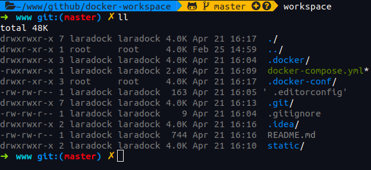

# Docker workspace

## How to run workspace

1. Clone repository to yours local directory where you save all projects.

2. Add alias to your .bashrc:
```
alias workspace='docker exec -e COLUMNS="`tput cols`" -e LINES="`tput lines`" -u laradock -it workspace /bin/zsh'
```

3. Run: `docker-compose pull` to download all necessary images.

4. Run: `docker-compose up -d` to run all containers in background mode.

5. Run: `docker-compose exec elasticsearch chown -R elasticsearch:elasticsearch /opt/elasticsearch/backup` to change elasticsearch permissions. (Required only once)

6. Run: `workspace` to enter workspace container:



## What's inside

- [Composer](https://getcomposer.org/) 2.x
- [Symfony CLI](https://symfony.com/download)
- node 14.x, npm 6.x
- php (version based on workspace image)

## How to run webserver

- Run `symfony server:start -d --no-tls` on the root of your application.

## Root?

- `laradock`

## Inspiration

- [Laradock](https://github.com/laradock/)
